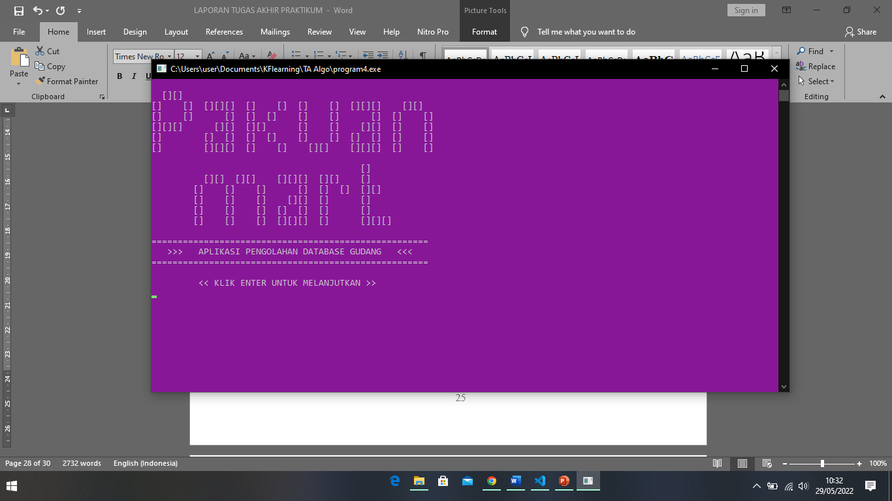
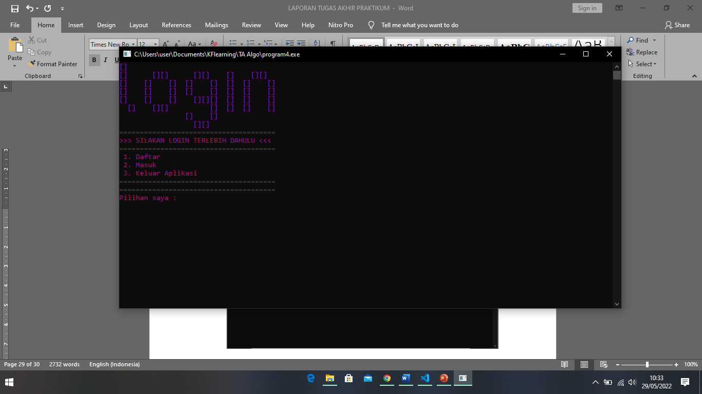
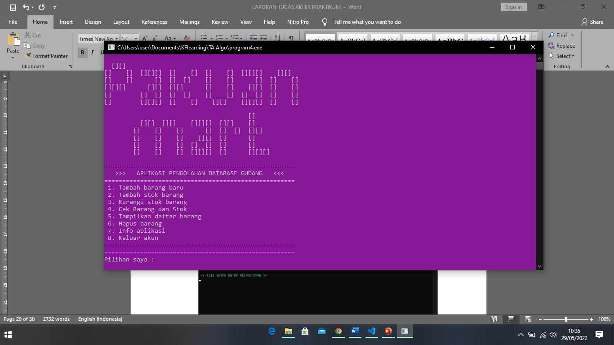
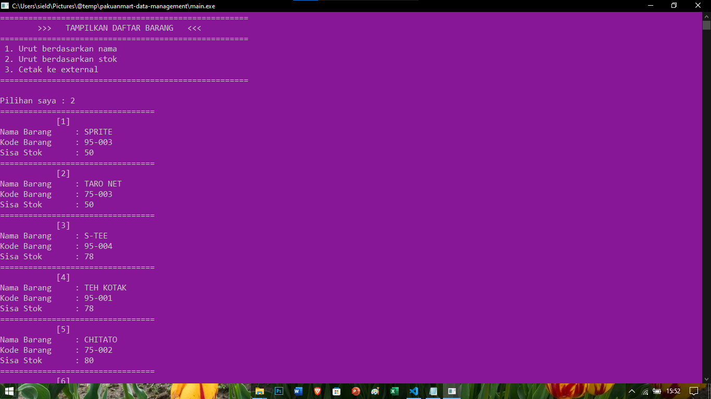

# Pakuan Mart Data Management
**Tugas akhir Algoritma dan Pemrograman Dasar semester 2**

Manajemen Barang Gudang Minimarket dengan Database RAM menggunakan Metode Linked List

**Repository:** [Click Here](https://github.com/bayufadayan/pakuanmart-data-management)

### Screenshots:

© *Project Akhir algo stuktur data semester 2*